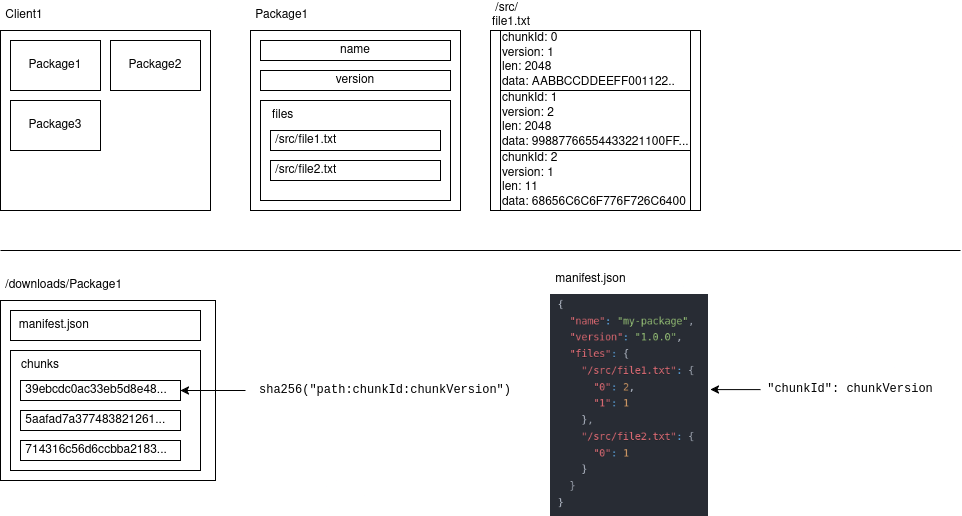
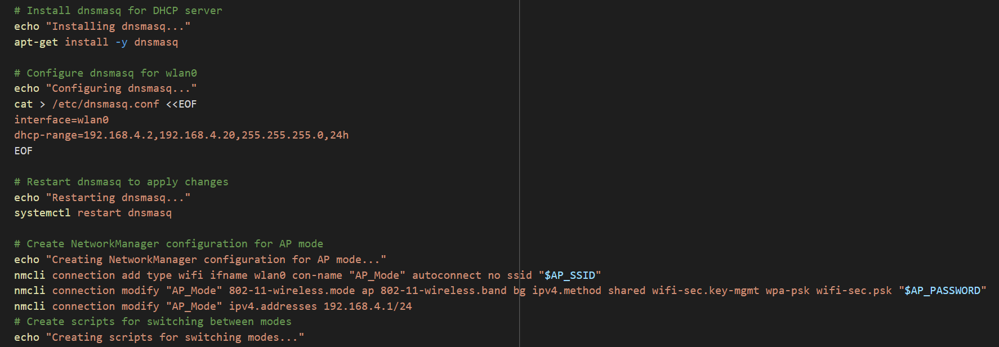
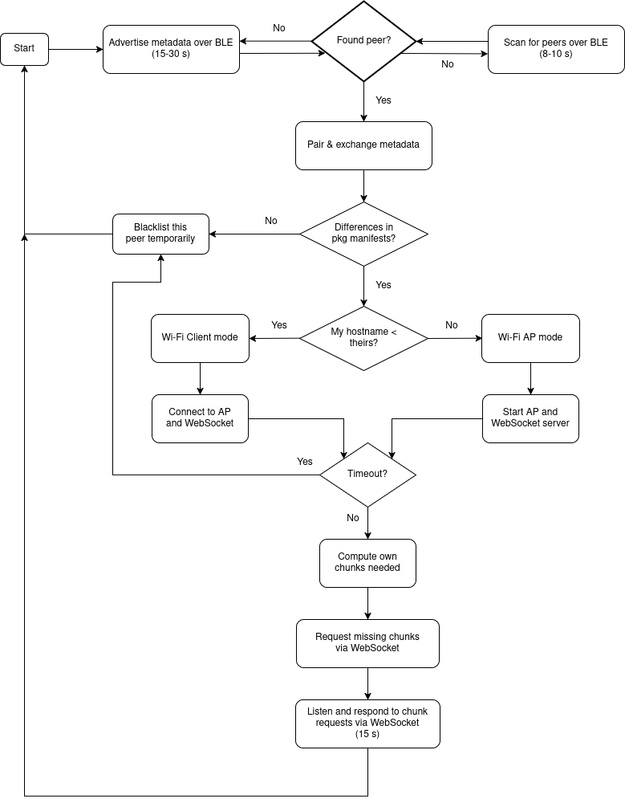
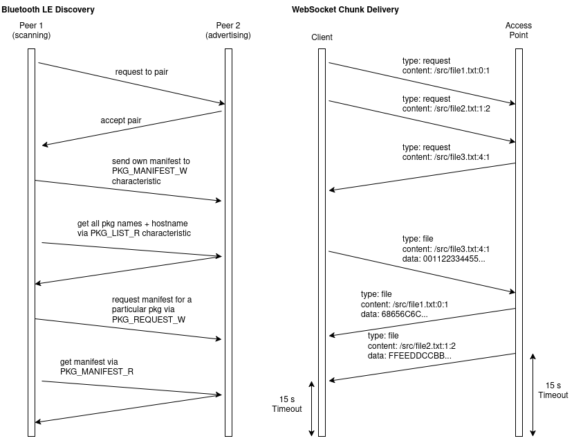

# Table of Contents
* Abstract
* [Introduction](#1-introduction)
* [Related Work](#2-related-work)
* [Technical Approach](#3-technical-approach)
* [Evaluation and Results](#4-evaluation-and-results)
* [Discussion and Conclusions](#5-discussion-and-conclusions)
* [References](#6-references)

# Abstract

We propose a method of wireless, peer-to-peer chunked file transfers between nearby embedded devices using a combination of Bluetooth Low Energy and temporary Wi-Fi Access Points. This would be useful for mass dissemination of content updates in environments without an Internet connection, in contrast to current methods such as CDNs and BitTorrent. Our decentralized system exchanges device and file state metadata through Bluetooth LE advertisements for lower power consumption, and switches to Wi-Fi afterwards for its faster file transfer speeds. We were able to demonstrate a successful proof of concept, with file transfer speeds of about 2.5 MB/s at close range and moderate power consumption, but we faced reliability issues during the Bluetooth LE pairing phase.

# 1. Introduction

## Motivation & Objective

We want to create peer-to-peer local ad-hoc file sharing software similar to BitTorrent or IPFS that multiple clients can use at once to deliver file updates to each other on the go, but without an internet connection.

## State of the Art & Its Limitations

Currently, peer-to-peer file sharing protocols such as BitTorrent do exist, which chunks files and allows transfers from various peers at once [1]. Additonally, certain operating systems like Windows do support decentralized update delivery over LAN, through a feature called Delivery Optimization [2]. BitTorrent, though, requires a central server known as a tracker, meaning it is unusable without an internet connection [1]. Windows' Delivery Optimization requires a central router in order to discover peers over LAN. We wish to create a system that purely uses Bluetooth LE and Wi-Fi Access Points to bypass the need altogether for an internet connection.

Apple AirDrop uses Bluetooth for advertisement and Wi-Fi to do peer-to-peer file transfers [3]. However, it only supports a single unidirectional connection between two devices at a time, and transfers files from start to finish rather than supporting partial chunks.

## Novelty & Rationale

Our approach uses Bluetooth LE for peers to advertise which files and chunks are available for sharing, and then spawns a Wi-Fi connection between each pair of peers to do the actual file transfer, where one hosts a Wi-Fi Access Point and Socket.IO server and the other connects to it. Therefore, no prior network infrastructure is required at all, and devices consume minimal power when not actively transferring files. We believe this idea has a good chance of succeeding because it builds on top of the P2P file sharing aspect of BitTorrent and IPFS, while using the mesh topology that has seen widespread adoption in enterprise and home networks today.

## Potential Impact

From a technical standpoint, if our project is successful, it would greatly reduce cloud computing operating costs for tech companies because most people wouldn't need to download their files directly from the companies' CDNs, so less bandwidth would be used. By taking some of the most data-consuming file transfers offline, widespread adoption of this technology would significantly reduce network congestion around the globe.

Speaking more broadly, though, our project would make technology more accessible to those in disadvantaged areas without a reliable internet connection. In certain parts of the U.S. such as Detroit, entire neighborhoods still lack high-speed internet access [10], and therefore the only option for receiving device updates at a reasonable speed without traveling is to download them from someone else. The proliferation of peer-to-peer mesh networks could also help disseminate information among those who live under oppressive governments. In Cuba, for example, nearly no one has access to the internet, and they distribute American media by smuggling USB drives into the country and passing around copies [11]. With a multi-hop mesh network like ours, information could spread over a much larger area more quickly, and its decentralized nature makes it resistant to government censorship.

## Challenges

Due to the wireless nature of this project, real-world tests could be negatively impacted by interference from other devices within range, especially in densely populated areas. If needed, we can simulate a worst-case connection loss scenario by physically unplugging select devices from power while they are in use.

One challenge that we anticipate is the differences in penetration between a 2.4GHz Bluetooth signal and a 5GHz Wi-Fi signal. This could lead to a situation where two clients are able to advertise their metadata to each other, but then can't initiate the actual file transfer. Our solution is to temporarily blacklist peers which initially are detectable over Bluetooth but fail to connect over Wi-Fi.

Also, the question of managing multiple peer connections presents a challenge. With each Raspberry Pi having a single Wi-Fi radio, it would not be possible to run multiple Wi-Fi connections at the same time, meaning that a client would have to use some solution like time-division multiplexing to switch between peers. It may also be the case that this proves to be too unreliable, slow, or simply not feasible for the scope of this project, in which case we would only attempt to connect to one peer at a time, temporarily blacklisting it after the fact to encourage discovery of new peers, so that data actually does get passed around to new places.

As for real-world security risks, there is a possibility of a peer "poisoning" the file chunks it transfers to other peers without a central source of truth to provide trustworthy checksums. This is a complex problem that we will not consider for the scope of this project. We also do not plan to use encryption between peers in our implementation, so the packets transferred could be sniffed by a third party.

## Requirements for Success

Knowledge of the Bluetooth LE protocol and the Wi-Fi Access Point setup process is necessary. The code will be written in Python, so knowledge of that language is assumed. In terms of hardware, the code should be able to run on any device supporting the aforementioned wireless protocols, but we are using three Raspberry Pi Zero 2 Ws because they are cheap. Power banks are also necessary in order to do real-world on-the-go testing.

## Metrics of Success

The main metrics of success that we would consider is average file transfer speed and time taken to establish a connection. Ideally, the first would be high and the second would be low. If additional time allows, we plan to run more trials to measure the speed to flood a network, the maximum number of connectable peers, power consumption when idle (not yet connected to a peer), power consumption while a file transfer is in progress, and maximum range from which a file can be successfully transferred between peers. All of these metrics would hopefully be high, except power consumption, which should be just a couple hundred milliwatts because we are using low-power devices with the Bluetooth Low Energy protocol.

# 2. Related Work

## Academic Papers

The decentralized peer-to-peer network topology that we are using in our project has been discussed at great length in existing literature, although not necessarily with an emphasis on embedded platforms or specific wireless technologies.

In [8], a novel peer-to-peer protocol design is discussed which increases stability in scenarios when peers are not expected to persist on the network and dedicate themselves to seeding assets which they have received in full, as is often the case with BitTorrent. This could be relevant to our protocol design when deciding which chunks of a file to transfer to another peer, especially due to the highly ephemeral nature of wireless communication between moving embedded devices.

nTorrent is an evolution of the BitTorrent protocol which uses Named Data Networking (NDN) instead of the traditional TCP/IP networking stack [9]. This seems pertinent to our project because we want the general capabilities of BitTorrent but without relying on internet technologies. Indeed, we intend on creating a data-centric protocol similar in purpose to NDN. Instead of locating a specific peer's IP address from which to receive data packets, a client in a data-centric protocol puts out a request for a specific asset, and who exactly serves the response is left up to the network. One of the nTorrent authors wrote a follow-up publication [12] demonstrating how it could be adapted to work in a multi-hop ad hoc environment, much like our own situation, and discusses the issue of peers within range that want different assets from each other; her solution is to have nodes which are dedicated purely to forwarding.

The IPFS protocol is discussed in [13]. IPFS is worth mentioning because it includes versioned snapshots of files in a similar manner to Git, while also having the decentralized swarm characteristics of BitTorrent, and our own project will need to support versioning capabilities. A lot of the protocol includes security considerations which we will probably not spend time implementing now, but shows a possible path forward for future study.

## Datasets

This project does not involve machine learning, so we are not using any training datasets. However, we will need to use sample files of some sort to demonstrate file transfer capabilities, eventually building an update dissemination mechanism on top of that. We intend to create binary files with random data to test the reliability of large monolithic file transfers, and also sort them into folders to test operation with a more complex folder structure.

## Software

We ended up using the following libraries and utilities in our code:

1. bleak [4]
2. bluez-peripheral [5]
3. NetworkManager [6]
4. dnsmasq [7]
5. python-socketio [14]

# 3. Technical Approach

## Packaging and Data Structures

We had to devise a way to bundle files along with their metadata in order to keep track of local state. In our system, a bundle of assets is referred to as a **package**. Each client can have numerous packages, each representing an application, video game, album, or some other sort of product. The package has some basic metadata, such as the "name" and "version" fields supplied in its **manifest.json** file. The manifest also contains a dictionary of file paths that the package contains, with each of these files having numerous chunks. Individual files do not exist concretely in the filesystem; in reality, they are a collection of chunks that must be reconstructed once all chunks are received.

**Chunks** are slices of binary data from each file, nominally sized at 2 KB each, and are referred to by their *index* (position in the file) and *version*. Every chunk does exist as a concrete file, named deterministically by taking the SHA-256 digest of the string `"path:chunkId:chunkVersion"` (of course, replacing these words with their actual values, i.e. `"/src/readme.txt:0:1"`). This way, multiple versions of chunks can be cached, in the event that the latest version of a file is not yet ready to be reconstructed. Chunks are the smallest unit of data that gets synced between devices.

The Package interface was designed in such a way that all filesystem operations were abstracted away. From the calling code's point of view, it is only concerned with writing arbitrary binary chunks to virtual file paths.

## Network Configuration Scripts

We decided to abandon Wi-Fi Direct from our project proposal in favor of Wi-Fi Access Points. After pairing over Bluetooth LE, the devices now use an asymmetrical setup, where one device agrees to host a Wi-Fi AP and Socket.IO server, and the other agrees to try connecting to it. This way, we did not have to mess around with sensitive system network config files directly, and could entirely rely on the NetworkManager CLI. To achieve this, though, we had to write a script `setup_ap_client_switch.sh` which does the initial work of creating the NetworkManager profiles for both client and AP, and installing dnsmasq, a DNS and DHCP server so the client can connect properly to its AP.

Shown below is a snippet of the `setup_ap_client_switch.sh` script.

## Syncing Algorithm

In essence, syncing works by comparing package manifests between two devices, and then having each device request newer versions of chunks that are present on the other. The difficulty here lies in the process of juggling multiple wireless technologies.

As we actually began work on the project, a few technical limitations and unsolvable bugs forced us to reconsider some parts of our software architecture, compared with what we wrote in the project proposal. Since we only had one Bluetooth radio, for instance, we had to alternate between advertising package metadata (with `bluez-peripheral`) for 15-30 seconds and scanning for 8-10 seconds (with `bleak`), with some randomness added to the exact delay time. This would repeat in a cycle until two peers discovered each other, but this process was very fickle in practice. In order to progress with the project, we ended up setting half our devices to be "permanent advertisers", and the other half to be "permanent scanners".

As mentioned above, we also switched from Wi-Fi Direct to Wi-Fi Access Points in another deviation from our original plan. As a result, two devices would now have to negotiate which one would host the AP, and which one would connect to it. For this, we used the simplest algorithm imaginable, which was to compare the lexicographic order of the hostname strings; the device with the lesser name would be responsible for hosting the AP. (The devices learn each other's hostnames from the metadata exchanged during the Bluetooth LE phase.) Obviously, this is a slightly unfair system, and in the real world we would want to pick a system with a more even balance.

Additionally, we realized that we had not planned on using any specific application-layer protocol for doing the actual chunk transfers once connected via Wi-Fi. This is where Socket.IO (a library built on top of WebSockets) came in [16].

A flowchart detailing the full algorithm is shown below.

## Communication Conventions

The following diagrams show the exact messages passed between devices over Bluetooth LE (left) and Socket.IO (right), during their respective phases of the syncing process.

The exchange of device and package metadata over Bluetooth LE is done through GATT characteristics, some readable and some writable. Their specific names are given in the diagram.

In the Socket.IO diagram, the messages shown are actually sent as JSON objects. The chunks, being binary data, had to be Base64 encoded for compatibility with JSON.

Finally, rather than using a handshake-type process to formalize the end of a file transfer, we set a 15-second timeout on both sides. We anticipate sudden connection loss before completion anyway due to the mobile nature of this project.

# 4. Evaluation and Results

A successful end-to-end demo of two Raspberry Pis discovering each other over Bluetooth LE and then syncing their packages once connected over Wi-Fi can seen in this [video](https://youtu.be/Ii-jBly4VO8).

## Connection Establishment Speed

The process of connecting over Bluetooth LE took much longer than anticipated. Even when we tried our best to create favorable conditions by bringing devices close together, increasing advertising intervals, and decreasing scan intervals, it still took between 10-45 seconds on average to successfully pair. Previously, when we had each device taking turns advertising and scanning for other Bluetooth devices, nothing would happen for several minutes. There were also many cases of the devices seeing each other from a scan, followed by extremely vague or undescriptive errors once attempting to pair. This could have been because in the time it took to request pairing, the advertising device had already switched into scanning mode. The "permanent scanner"/"permanent advertiser" method worked best.

## File Transfer Speed

At first, large files were taking far too long to transfer to appreciably measure. We were able to fix this by increasing the chunk size from 2 KB to 4 MB, so dealing with a large quantity of chunks does seem to introduce a fair bit of overhead. After that adjustment was made, a 128 MB file transfer took approximately 50 seconds to transfer over Wi-Fi (80 seconds counting the Bluetooth pairing and Wi-Fi connecting time). Therefore, the average file transfer speed we achieved in the best case was about 2.5 MB/s, which is perfectly reasonable for our low-power wireless setup.

## Other Observations

By observing the remaining charge on our power banks, we were able to observe that continuously broadcasting and scanning over Bluetooth consumed more power than we had anticipated. In a matter of a few hours of continuous testing, we had drained a couple thousand mAh of energy from our 10,000 mAh power banks, which indicates at least several hundred milliamps worth of current draw.

Additionally, the Raspberry Pis had great difficulty connecting to each other from more than a couple yards apart. While it was hard to get an exact reading on background noise levels, the apartment building we tested our project in had at least ten other Bluetooth devices within range at all times, as we saw from scanning from our mobile phones, meaning that there were many possible sources of interference. We tried turning off the Wi-Fi radio through the command line to eliminate one such source of interference but observed no appreciable difference. A stronger Bluetooth radio would be a possible upgrade, but at the expense of greater power consumption.

# 5. Discussion and Conclusions

Our project was a success in the sense that we were able to demonstrate a working proof of concept, with a good enough file transfer speed for practical use. Still, there are plenty of improvements that could be made with additional time and resources to address some remaining flaws.

Firstly, a second Bluetooth radio on every device would prove to be very helpful, since one cannot scan and advertise simultaneously on the same radio. Furthermore, the process we attempted of switching between scanning/advertising modes on a single radio was greatly unsuccessful. The Bluetooth pairing stage was, as a result, one of the greatest hurdles we encountered during the project's development. A second radio would likely make the process a lot easier and reliable, at the cost of more power consumption. We could also explore different methods while sticking to one radio, such as randomly assigning scanner/advertiser status to each device on a daily basis, except that this would have the side effect of reducing the pool of peers that can be discovered.

We were not able to get a precise read on power consumption, but according to Jean-Luc Aufranc of CNX Software, connecting a Raspberry Pi Zero 2 W to a 2.4 GHz Wi-Fi Access Point should only incur +11 mA current draw [15]. This amount spikes to +187 mA after running iperf, though, which means that our power consumption from transferring files repeatedly was not unreasonable, per se. There was no conclusive data on the effect of pairing Bluetooth devices, although it is implied that at idle state, it uses next to no power (+9 mA for enabling a combination of Bluetooth, Wi-Fi, audio, camera/display detection). All things considered, this would be worth reexamining with proper equipment.

Next, it is worth addressing the speed of Bluetooth pairing. Even after implementing our workaround for the last issue, the pairing process took longer than expected, from anywhere between 10-45 seconds. If this issue remains, then there is nearly zero chance of a momentary encounter while walking/running resulting in any successful chunk transfers; the project would instead be better suited for more stationary environments without an Internet connection, such as in a subway tunnel. It is possible that poor signal strength, interference, or even unoptimized code is to blame for this. As a reference, we observed that pairing through an app on our phones was quicker and more reliable than Pi-to-Pi pairing, so there is a lot of room for improvement here.

Finally, cybersecurity was not at all a concern when developing this project, but it is absolutely necessary that the protocol be redesigned in a secure and robust way before this project sees real-world adoption. In its current state, a bad actor could manipulate version numbers to send malicious chunks to their peers, which would be accepted without question. A potential solution would involve using checksums on every chunk, and perhaps using package manifests that are cryptographically signed by their original distributor. Previous technologies like BitTorrent already use checksums to secure their P2P protocols [1].

## Contributions

Both team members contributed equally to bug fixing and testing. James' coding responsibilites focused on design, implementation, and integration of the packaging system, as well as the main event loop and state machine. Jacob worked more on the side of networking code for Bluetooth LE, Wi-Fi, and Socket.IO.

# 6. References

[1] https://en.wikibooks.org/wiki/The_World_of_Peer-to-Peer_(P2P)/Networks_and_Protocols/BitTorrent

[2] https://learn.microsoft.com/en-us/windows/deployment/do/waas-delivery-optimization

[3] https://www.xda-developers.com/airdrop/

[4] bleak. URL: https://github.com/hbldh/bleak

[5] bluez-peripheral. URL: https://github.com/spacecheese/bluez_peripheral

[6] NetworkManager. URL: https://networkmanager.dev/

[7] dnsmasq. URL: https://dnsmasq.org/doc.html

[8] O. Bilgen and A. B. Wagner, "A new stable peer-to-peer protocol with non-persistent peers," IEEE INFOCOM 2017 - IEEE Conference on Computer Communications, Atlanta, GA, USA, 2017, pp. 1-9, doi: 10.1109/INFOCOM.2017.8057141. keywords: {Protocols;Stability analysis;Peer-to-peer computing;Wireless communication;Conferences;Mobile communication;Servers}. URL: https://ieeexplore.ieee.org/document/8057141.

[9] S. Mastorakis, A. Afanasyev, Y. Yu and L. Zhang, "nTorrent: Peer-to-Peer File Sharing in Named Data Networking," 2017 26th International Conference on Computer Communication and Networks (ICCCN), Vancouver, BC, Canada, 2017, pp. 1-10, doi: 10.1109/ICCCN.2017.8038462. keywords: {Peer-to-peer computing;TCPIP;Protocols;Cryptography;Routing}. URL: https://ieeexplore.ieee.org/document/8038462.

[10] https://www.youtube.com/watch?v=1B0u6nvcTsI

[11] https://www.youtube.com/watch?v=fTTno8D-b2E

[12] Chou, Kimberly. (2018). Multi-Hop Communication for nTorrent in a Wireless Ad Hoc Environment. 10.48550/arXiv.1812.02791. URL: https://arxiv.org/abs/1812.02791.

[13] Benet, J. (2014). IPFS - Content Addressed, Versioned, P2P File System. ArXiv, abs/1407.3561. URL: https://arxiv.org/abs/1407.3561.

[14] python-socketio. URL: https://python-socketio.readthedocs.io/en/latest/index.html

[15] A deep dive into Raspberry Pi Zero 2 W's power consumption, by Jean-Luc Aufranc (CNXSoft). URL: https://www.cnx-software.com/2021/12/09/raspberry-pi-zero-2-w-power-consumption/

[16] Socket.IO. URL: https://socket.io/
